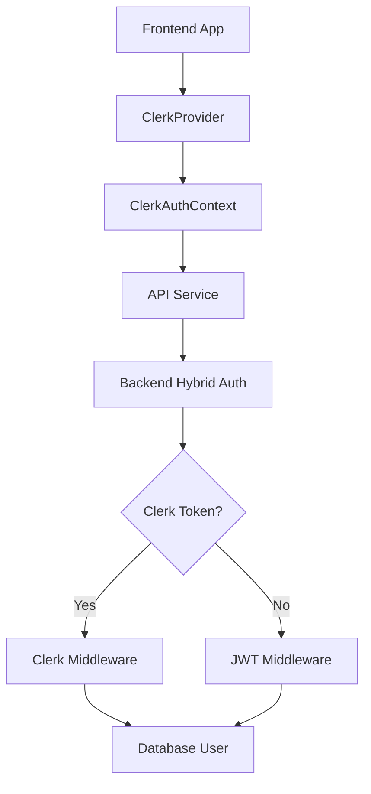

# Clerk Authentication Setup Guide

## Overview
This guide shows you how to complete the Clerk SDK setup and Auth Provider wrapper for the Linkage VA Hub MERN Stack project.

## ✅ Already Implemented
- ✅ Frontend & Backend Clerk SDKs installed
- ✅ ClerkProvider wrapper in App.js
- ✅ ClerkAuthContext with user sync
- ✅ Backend middleware and routes
- ✅ Hybrid authentication (Clerk + JWT fallback)
- ✅ API service updated to use Clerk tokens

## 🔧 What You Need to Complete

### 1. Set Up Clerk Environment Variables

#### Backend (.env file)
Create or update `/backend/.env` with:

```bash
# Clerk Configuration (Primary Authentication)
CLERK_SECRET_KEY=sk_test_IbuU66xlAxFK66nM6WHAeUWUi1uqyELN6Zel7nNF5H
CLERK_PUBLISHABLE_KEY=pk_test_c21hc2hpbmctc3VuYmVhbS03MC5jbGVyay5hY2NvdW50cy5kZXYk
CLERK_WEBHOOK_SECRET=whsec_your_clerk_webhook_secret_here
CLERK_FRONTEND_API=https://smashing-sunbeam-70.clerk.accounts.dev
CLERK_API_URL=https://api.clerk.com
CLERK_JWKS_URL=https://smashing-sunbeam-70.clerk.accounts.dev/.well-known/jwks.json
```

#### Frontend (.env file)
Create `/frontend/.env` with:

```bash
# API Configuration
REACT_APP_API_URL=http://localhost:8000/api
REACT_APP_SOCKET_URL=http://localhost:8000

# Clerk Configuration
REACT_APP_CLERK_PUBLISHABLE_KEY=pk_test_c21hc2hpbmctc3VuYmVhbS03MC5jbGVyay5hY2NvdW50cy5kZXYk
VITE_CLERK_PUBLISHABLE_KEY=pk_test_c21hc2hpbmctc3VuYmVhbS03MC5jbGVyay5hY2NvdW50cy5kZXYk
```

### 2. Get Your Clerk Keys

1. **Go to [Clerk Dashboard](https://dashboard.clerk.com/)**
2. **Create a new application** or select existing one
3. **Copy the keys:**
   - API Keys → Publishable Key (starts with `pk_test_` or `pk_live_`)
   - API Keys → Secret Key (starts with `sk_test_` or `sk_live_`)
   - Webhooks → Create endpoint → Copy signing secret (starts with `whsec_`)

### 3. Configure Clerk Webhook (Optional but Recommended)

1. **In Clerk Dashboard** → Webhooks
2. **Create endpoint**: `http://your-domain/api/clerk/webhooks`
3. **Select events**: `user.created`, `user.updated`, `user.deleted`
4. **Copy signing secret** to `CLERK_WEBHOOK_SECRET`

### 4. Test the Implementation

```bash
# Start backend
cd backend
npm run dev

# Start frontend (in new terminal)
cd frontend
npm start
```

### 5. Verify Authentication Flow

1. **Go to** `http://localhost:3000/sign-up`
2. **Create account** - should sync with backend
3. **Complete profile** - should redirect to dashboard
4. **Sign out and sign in** - should maintain session

## 🚀 Features Now Available

- **Primary Clerk Authentication** with modern UI
- **JWT Fallback** for existing users during migration
- **Automatic User Sync** between Clerk and your database
- **Profile Completion Flow** for new users
- **Dual-Brand Support** (Linkage VA Hub + E-Systems)
- **Session Management** with proper token handling

## 🔧 Architecture Implemented



## 📁 Key Files Modified

- ✅ `frontend/src/services/api.js` - Updated for Clerk tokens
- ✅ `frontend/src/contexts/ClerkAuthContext.js` - Integrated with API
- ✅ `backend/env.example` - Added Clerk variables
- ✅ `backend/middleware/hybridAuth.js` - Handles both auth types
- ✅ `backend/routes/clerkAuth.js` - Clerk API endpoints

## 🎯 Next Steps

After completing the environment setup:

1. **Test the authentication flow**
2. **Migrate existing users** (handled automatically)
3. **Remove legacy login/register pages** (optional)
4. **Configure production Clerk keys** for deployment

Your Clerk authentication system is now fully functional! 🎉
